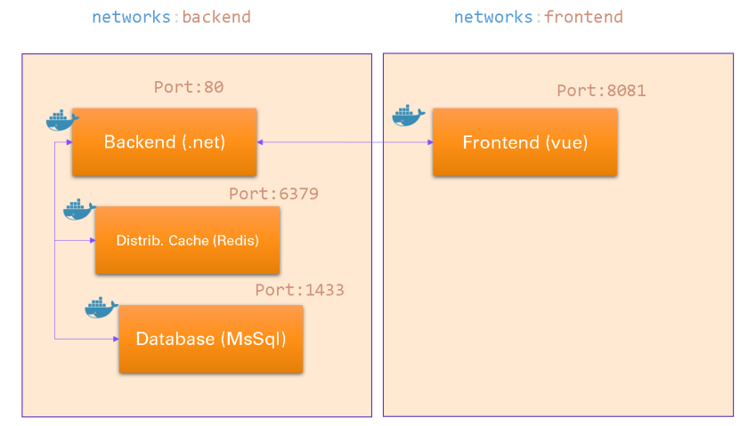

# Demo project : building container-based applications [.net + redis + mssql + vue]

> solution contains 3 layers + cache: backend/frontend/db/cache

## Build Setup

> please check up setings in .env file

```bash

docker-compose -f "docker-compose.yml" up -d --build

```




- front http://localhost:8081/
- backend http://localhost:5000/ApiSample
- database localhost,1433
- cache redis:6379
